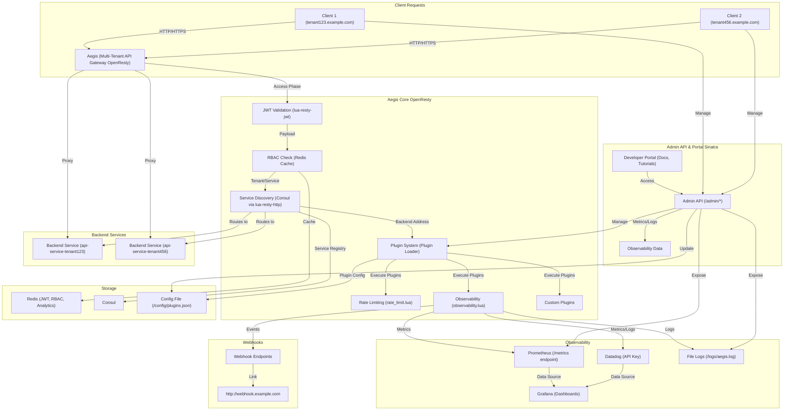

# Aegis

Aegis is a multi-tenant API Gateway built on OpenResty with a Sinatra admin API. The core handles high-performance routing, while the admin provides management.

_© 2025 Kenneth C. Demanawa. All Rights Reserved._

